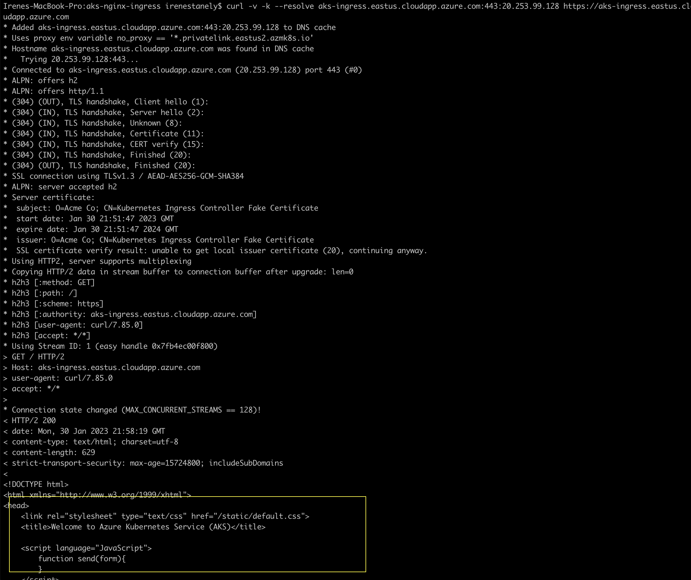
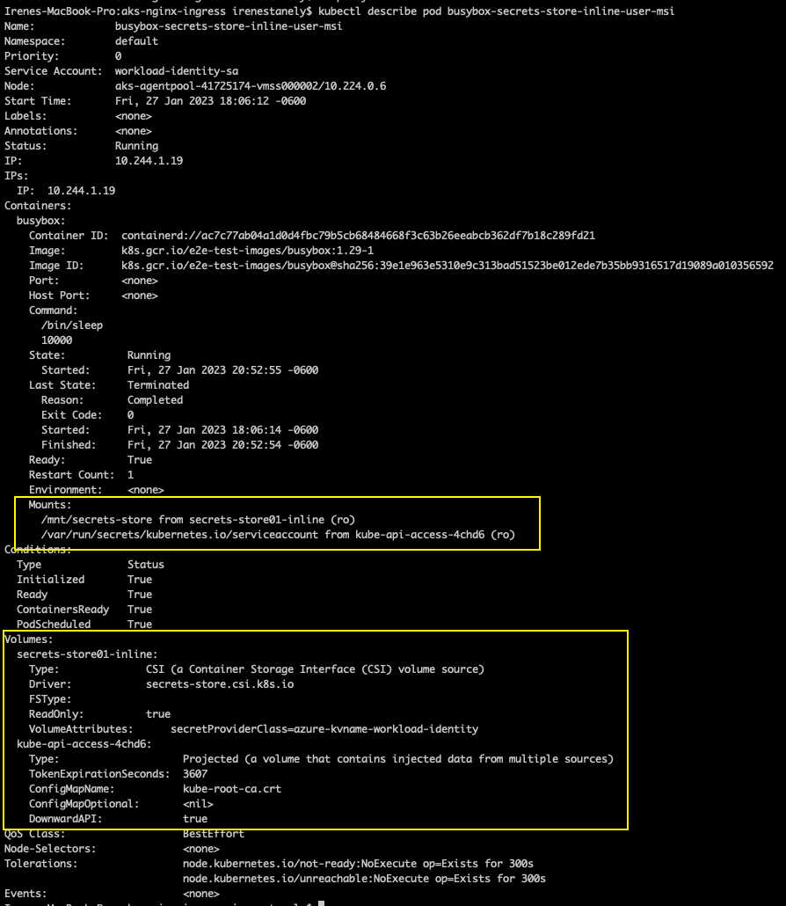

# AKS Cluster with Nginx Ingress Controller

This contains sample specs of securing an NGINX Ingress Controller with TLS cert accessing a hello-world application on Azure Kubernetes Service (AKS) cluster. 
Azure Key Vault (AKV) instance is used as a secret store for tls cert and Secret Store CSI Driver is used for integrating the secret stores with Kubernetes via Container Storage Interface(CSI) volume. For more information, see [csi-secrets-store-nginx-tls]([csi-secrets-store-nginx-tls](https://learn.microsoft.com/en-us/azure/aks/csi-secrets-store-nginx-tls)).

Similar to Kubernetes secrets, on pod start and restart, the Secrets Store CSI driver communicates with the provider using gRPC to retrieve the secret content from the external Secrets Store specified in the SecretProviderClass custom resource. Then the volume is mounted in the pod as tmpfs and the secret contents are written to the volume.

The [Secrets Store CSI Driver](https://secrets-store-csi-driver.sigs.k8s.io/concepts.html) on Azure Kubernetes Service (AKS) provides a variety of methods of identity-based access to your Azure key vault. In this example we have used AKS with Azure AD WorkloadIdentity (preview) to access the Azure resources.

The Secrets Store CSI driver secrets-store.csi.k8s.io allows Kubernetes to mount multiple secrets, keys, and certs stored in enterprise-grade external secrets stores into their pods as a volume. Once the Volume is attached, the data in it is mounted into the container's file system.

## Prerequisites 

Please install the below in your operating system and use the same resource group for the below steps

1. [Helm 3](https://helm.sh/docs/intro/install/) 
2. Azure account
3. Azure CLI(https://learn.microsoft.com/en-us/cli/azure/install-azure-cli)

If you have multiple Azure subscriptions, select the appropriate subscription ID in which the resources should be billed using the az account command.

```bash
az login 
az account set --subscription <subscription>
```

## Installation 

Please substitute the necessary placeholder values in the below steps

### Environment variables

Please set up the environmental values necessary for this setup can be added to the env.sh and ran to set the values for the session.

```bash
source ./env.sh
```

### Deploy AKS Cluster 

Deploy an AKS cluster using the Azure CLI that includes the following
 * Azure AD workload identity(preview)
 * OpenId Connect issuer
 * Azure Keyvault secrets provider
 
```bash 
az aks create -g $RESOURCE_GROUP_NAME --name $AKS_CLUSTER_NAME \
  --location $LOCATION \
  --node-count $NODE_COUNT \
  --enable-oidc-issuer \
  --enable-workload-identity \
  --enable-addons azure-keyvault-secrets-provider
 
export AKS_OIDC_ISSUER="$(az aks show --resource-group $RESOURCE_GROUP_NAME --name $AKS_CLUSTER_NAME --query "oidcIssuerProfile.issuerUrl" -o tsv)"
```

### Kubeconfig setup 

```bash
az aks get-credentials --resource-group $RESOURCE_GROUP_NAME --name $AKS_CLUSTER_NAME --file ~/.kube_config
```

### Verify the Azure Key Vault Provider for Secrets Store CSI Driver installation

Verify that each node in your cluster's node pool has a Secrets Store CSI Driver pod and a Secrets Store Provider Azure pod running.

```bash
kubectl get pods -n kube-system -l 'app in (secrets-store-csi-driver,secrets-store-provider-azure)'

NAME                                     READY   STATUS    RESTARTS   AGE
aks-secrets-store-csi-driver-4vpkj       3/3     Running   2          4m25s
aks-secrets-store-csi-driver-ctjq6       3/3     Running   2          4m21s
aks-secrets-store-csi-driver-tlvlq       3/3     Running   2          4m24s
aks-secrets-store-provider-azure-5p4nb   1/1     Running   0          4m21s
aks-secrets-store-provider-azure-6pqmv   1/1     Running   0          4m24s
aks-secrets-store-provider-azure-f5qlm   1/1     Running   0          4m25s
```

### TLS cert creation 

```bash
export KEY_PATH="aks-ingress-tls.key"
export CERT_NAME="aks-ingress-cert"
export CERT_PATH="aks-ingress-tls.crt"
export CERT_WITH_KEY_PATH="aks-ingress-tls-withkey.pem"
export HOST_NAME="<Your Host>"

openssl req -x509 -nodes -days 365 -newkey rsa:2048 \    
-out $CERT_PATH \    
-keyout $KEY_PATH \    
-subj "/CN=$HOST_NAME/O=$CERT_NAME"

cat $CERT_PATH $KEY_PATH > $CERT_WITH_KEY_PATH
```

### Import cert to Keyvault 

```bash
az keyvault create -n $AKV_NAME -g $RESOURCE_GROUP_NAME -l $

az keyvault certificate import --vault-name $AKV_NAME -n $CERT_NAME -f $CERT_WITH_KEY_PATH
```

### Create an Azure Active Directory(Azure AD) workload identity and Kubernetes service account 

```bash
export IDENTITY_NAME = 'tlssecretidentity'

az identity create --name $IDENTITY_NAME --resource-group $RESOURCE_GROUP_NAME

export USER_ASSIGNED_CLIENT_ID="$(az identity show -g $RESOURCE_GROUP_NAME --name $IDENTITY_NAME  --query 'clientId' -o tsv)"

export IDENTITY_TENANT=$(az aks show --name $AKS_CLUSTER_NAME--resource-group $RESOURCE_GROUP_NAME --query aadProfile.tenantId -o tsv)
```

### Managed Identity access to Keyvault  

```bash
az keyvault set-policy -n $AKV_NAME --key-permissions get --spn $USER_ASSIGNED_CLIENT_ID

az keyvault set-policy -n $AKV_NAME --secret-permissions get --spn $USER_ASSIGNED_CLIENT_ID

az keyvault set-policy -n $AKV_NAME --certificate-permissions get --spn $USER_ASSIGNED_CLIENT_ID
```

### AKS Service account and Configure the managed identity for token federation

```bash
export serviceAccountName="workload-identity-sa"
export serviceAccountNamespace="default"

cat <<EOF | kubectl apply -f -
apiVersion: v1
kind: ServiceAccount
metadata:
  annotations:
    azure.workload.identity/client-id: ${USER_ASSIGNED_CLIENT_ID}
  labels:
    azure.workload.identity/use: "true"
  name: ${serviceAccountName}
  namespace: ${serviceAccountNamespace}
EOF

export federatedIdentityName="aksfederatedidentity"

az identity federated-credential create --name $federatedIdentityName --identity-name <identity_name>  --resource-group <resource_group_of_aks> --issuer ${AKS_OIDC_ISSUER} --subject system:serviceaccount:${serviceAccountNamespace}:${serviceAccountName}
```
### Create secret provider class

To use the Secrets Store CSI driver, create a SecretProviderClass custom resource to provide driver configurations and provider-specific parameters to the CSI driver.

The Secrets Store CSI Driver secrets-store.csi.k8s.io allows Kubernetes to mount multiple secrets, keys, and certs stored in enterprise-grade external secrets stores into their pods as a volume. Once the Volume is attached, the data in it is mounted into the container’s file system.

Azure Key Vault provider for Secrets Store CSI Driver allows you to get secret contents stored in an Azure Key Vault instance and use the Secrets Store CSI driver interface to mount them into Kubernetes pods.

To ensure your application is using the Secrets Store CSI driver, update your deployment yaml to use the secrets-store.csi.k8s.io driver and reference the SecretProviderClass resource created in the previous step.

> **_NOTE:_** Please substitute the necessary placeholder values before running the `secretproviderclass.yaml` and `pod.yaml` files.

```bash
kubectl apply -f ./kube-manifests/secretProviderClass/secretProviderClass.yaml

#(optional) if you like to deploy a sample app using secret store
kubectl apply -f ./sample-app.yaml
```

### Install helm ingress controller with volume mount 

```bash
source ./helm/nginx-ingress-controller-helm.sh
```

### Deploy hello-world applications and ingress

```bash
kubectl apply -f ./kube-manifests/pod/aks-helloworld-one.yaml
kubectl apply -f ./kube-manifests/pod/aks-helloworld-two.yaml
kubectl apply -f ./kube-manifests/ingress/hello-world-ingress.yaml
```

### Validation 

Get the EXTERNAL-IP of the ingress from the below command

```bash
kubectl get service --namespace default --selector app.kubernetes.io/name=ingress-nginx
```

Curl to the ingress to see if its connecting(200 OK) to the app using tls. The result is as seen below

```bash
curl -v -k --resolve <host_name>:443:<external_ip_above_command> https://<host_name>
```



The ingress, container(sample app) pod should be successfully running with the volume mount and volume as highlighted below.

```bash
kubectl get pods -n <namespace>
```


```bash
kubectl describe pod <pod_name> -n <namespace>
```

