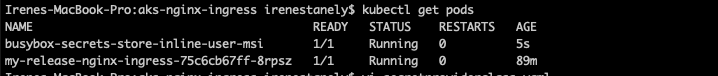

# AKS Cluster with Nginx Ingress Controller

This contains sample specs of securing an NGINX Ingress Controller with TLS with an Azure Kubernetes Service (AKS) cluster and an Azure Key Vault (AKV) instance. For more information, see [csi-secrets-store-nginx-tls]([csi-secrets-store-nginx-tls](https://learn.microsoft.com/en-us/azure/aks/csi-secrets-store-nginx-tls)).

Similar to Kubernetes secrets, on pod start and restart, the Secrets Store CSI driver communicates with the provider using gRPC to retrieve the secret content from the external Secrets Store specified in the SecretProviderClass custom resource. Then the volume is mounted in the pod as tmpfs and the secret contents are written to the volume.

The [Secrets Store CSI Driver](https://secrets-store-csi-driver.sigs.k8s.io/concepts.html) on Azure Kubernetes Service (AKS) provides a variety of methods of identity-based access to your Azure key vault. In this example we have used AKS with Azure AD WorkloadIdentity (preview) to access the Azure resources.

The Secrets Store CSI driver secrets-store.csi.k8s.io allows Kubernetes to mount multiple secrets, keys, and certs stored in enterprise-grade external secrets stores into their pods as a volume. Once the Volume is attached, the data in it is mounted into the container's file system.

## Prerequisites 

Please install the below in your operating system and use the same resource group for the below steps

1. [Helm 3](https://helm.sh/docs/intro/install/) 
2. Azure account
3. Azure CLI(https://learn.microsoft.com/en-us/cli/azure/install-azure-cli)

If you have multiple Azure subscriptions, select the appropriate subscription ID in which the resources should be billed using the az account command.

```bash
az login 
az account set --subscription <subscription>
```

## Installation 

Please substitute the necessary placeholder values in the below steps

### Deploy AKS Cluster 

Deploy an AKS cluster using the Azure CLI that includes the following
 * Azure AD workload identity(preview)
 * OpenId Connect issuer
 * Azure Keyvault secrets provider
 
```bash 
az aks create -g $RESOURCE_GROUP_NAME --name $AKS_CLUSTER_NAME \
  --location $LOCATION \
  --node-count $NODE_COUNT \
  --enable-oidc-issuer \
  --enable-workload-identity \
  --enable-addons azure-keyvault-secrets-provider
 
export AKS_OIDC_ISSUER="$(az aks show --resource-group $RESOURCE_GROUP_NAME --name $AKS_CLUSTER_NAME --query "oidcIssuerProfile.issuerUrl" -o tsv)"
```

### Kubeconfig setup 

```bash
az aks get-credentials --resource-group <resource_group_of_aks> --name <aks_cluster_name> --file ~/.kube_config
```

### Verify the Azure Key Vault Provider for Secrets Store CSI Driver installation

Verify that each node in your cluster's node pool has a Secrets Store CSI Driver pod and a Secrets Store Provider Azure pod running.

```bash
kubectl get pods -n kube-system -l 'app in (secrets-store-csi-driver,secrets-store-provider-azure)'

NAME                                     READY   STATUS    RESTARTS   AGE
aks-secrets-store-csi-driver-4vpkj       3/3     Running   2          4m25s
aks-secrets-store-csi-driver-ctjq6       3/3     Running   2          4m21s
aks-secrets-store-csi-driver-tlvlq       3/3     Running   2          4m24s
aks-secrets-store-provider-azure-5p4nb   1/1     Running   0          4m21s
aks-secrets-store-provider-azure-6pqmv   1/1     Running   0          4m24s
aks-secrets-store-provider-azure-f5qlm   1/1     Running   0          4m25s
```

### TLS cert creation 

```bash
export KEY_PATH="aks-ingress-tls.key"
export CERT_NAME="aks-ingress-tls"
export CERT_PATH="aks-ingress-tls.crt"
export CERT_WITH_KEY_PATH="aks-ingress-tls-withkey.pem"
export HOST_NAME="<Your Host>"

openssl req -x509 -nodes -days 365 -newkey rsa:2048 \    
-out $CERT_PATH \    
-keyout $KEY_PATH \    
-subj "/CN=$HOST_NAME/O=$CERT_NAME"

cat $CERT_PATH $KEY_PATH > $CERT_WITH_KEY_PATH
```

### Import cert to Keyvault 

```bash
az keyvault create -n $AKV_NAME -g $RESOURCE_GROUP_NAME -l $

az keyvault certificate import --vault-name $AKV_NAME -n $CERT_NAME -f $CERT_WITH_KEY_PATH
```

### Create an Azure Active Directory(Azure AD) workload identity and Kubernetes service account 

```bash
az identity create --name <identity_name> --resource-group <resource_group_of_aks

export USER_ASSIGNED_CLIENT_ID="$(az identity show -g <resource_group_of_aks> --name <identity_name> --query 'clientId' -o tsv)"

export IDENTITY_TENANT=$(az aks show --name <aks_cluster_name> --resource-group <resource_group_of_aks>  --query aadProfile.tenantId -o tsv)
```

### Managed Identity access to Keyvault  

```bash
az keyvault set-policy -n $AKV_NAME --key-permissions get --spn $USER_ASSIGNED_CLIENT_ID

az keyvault set-policy -n $AKV_NAME --secret-permissions get --spn $USER_ASSIGNED_CLIENT_ID

az keyvault set-policy -n $AKV_NAME --certificate-permissions get --spn $USER_ASSIGNED_CLIENT_ID
```

### AKS Service account and Configure the managed identity for token federation

```bash
export serviceAccountName="workload-identity-sa"
export serviceAccountNamespace="default"

cat <<EOF | kubectl apply -f -
apiVersion: v1
kind: ServiceAccount
metadata:
  annotations:
    azure.workload.identity/client-id: ${USER_ASSIGNED_CLIENT_ID}
  labels:
    azure.workload.identity/use: "true"
  name: ${serviceAccountName}
  namespace: ${serviceAccountNamespace}
EOF

export federatedIdentityName="aksfederatedidentity"

az identity federated-credential create --name $federatedIdentityName --identity-name <identity_name>  --resource-group <resource_group_of_aks> --issuer ${AKS_OIDC_ISSUER} --subject system:serviceaccount:${serviceAccountNamespace}:${serviceAccountName}
```

### Nginx Ingress

Install the below after successful aks cluster installation

```bash
# add the helm chart
helm repo add nginx-stable https://helm.nginx.com/stable
helm repo update
kubectl create ns ingress
# install the nginx ingress
helm install my-release nginx-stable/nginx-ingress
```

### Tls cert creation and import to Azure Keyvault

After the helm chart installation, follow the below steps for cert creation

```bash
KEY_PATH="aks-ingress-tls.key"
CERT_PATH="aks-ingress-tls.crt"
CERT_WITH_KEY_PATH="aks-ingress-tls-withkey.pem"
HOST_NAME="<Your Host>"

openssl req -x509 -nodes -days 365 -newkey rsa:2048 -keyout $KEY_PATH -out $CERT_PATH -subj '//CN=$HOST_NAME//O=$HOST_NAME'

cat $CERT_PATH $KEY_PATH > $CERT_WITH_KEY_PATH
```

### Import the pem file to Azure Keyvault

```bash
az keyvault certificate import --vault-name <Your Azure Key Vault> -n <cert_name> -f $CERT_WITH_KEY_PATH
```

### Create secret provider class

> **_NOTE:_** Please substitute the necessary placeholder values before running the `secretproviderclass.yaml` and `pod.yaml` files.

```bash
kubectl apply -f secretproviderclass.yaml

kubectl apply -f pod.yaml
```

### Validation 

The ingress, container pod should be successfully running with the volume mount and volume as highlighted below.

```bash
kubectl get pods -n <namespace>
```



```bash
kubectl describe pod <pod_name> -n <namespace>
```


